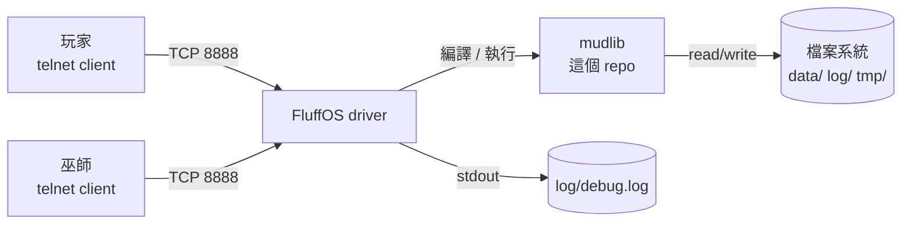

# 03 系統脈絡

## 系統邊界



系統邊界很窄：**只有一個對外介面，就是 telnet 埠 8888**。

沒有 HTTP API、沒有資料庫、沒有訊息佇列、沒有對外的網路呼叫。
所有狀態都在記憶體與檔案系統裡。

## 外部介面

| 介面 | 方向 | 說明 |
|---|---|---|
| telnet :8888 | 入 | 玩家與巫師的唯一入口。`etc/fluffos.cfg` 的 `port number` |
| 檔案系統 | 雙向 | 存檔、log。路徑受 master 的 `valid_read`/`valid_write` 管制 |
| stdout / debug.log | 出 | 驅動與 mudlib 的錯誤輸出 |

驅動支援的 telnet 擴充（MXP、GMCP、ZMP、MSSP、MSP、MSDP）在
`etc/fluffos.cfg` 裡多數是關的 —— 這個 MUD 的玩家用的是傳統 client，
開了只是徒增變數。目前只留 GMCP 與 MSSP。

### 曾經有、但已經不在的介面

`/adm/daemons/network/` 底下有一整套 intermud 網路程式碼（`mudlist`、
`gchannel`、`netmail`、`tcp`），那是 1990 年代 MUD 之間互連的協定。
現在那些伺服器早就不存在了，相關檔案多數編譯失敗，屬於死碼。

`/std/socket/` 下也有 socket 支援，同樣是那個年代的產物。

## 資料流

玩家的一次互動：

```
telnet 輸入
  → driver 收封包
  → connection 物件（互動物件）
  → body 物件的 cmd_hook()
  → 推進 cmd_stack 佇列
  → heart_beat() 取出執行
  → /cmds/<group>/_<verb>.c 的 cmd_<verb>()
  → 改變世界狀態（ob_data）
  → tell_room() / write() 產生輸出
  → driver 送回 telnet
```

注意**指令不是立即執行的**，中間隔了一層佇列與心跳。
詳見 [06 執行期視圖](06-runtime-view.md)。
