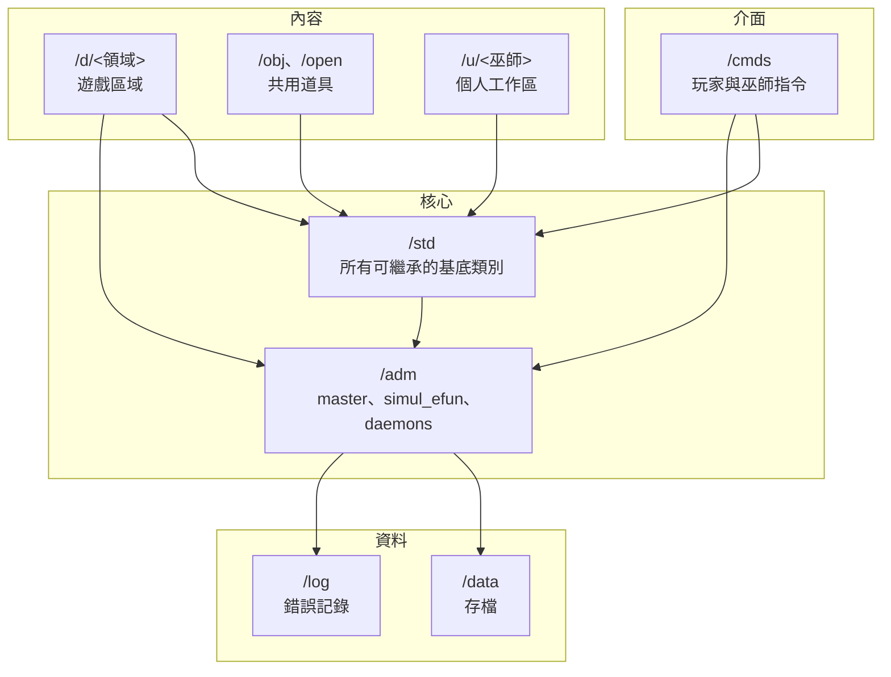
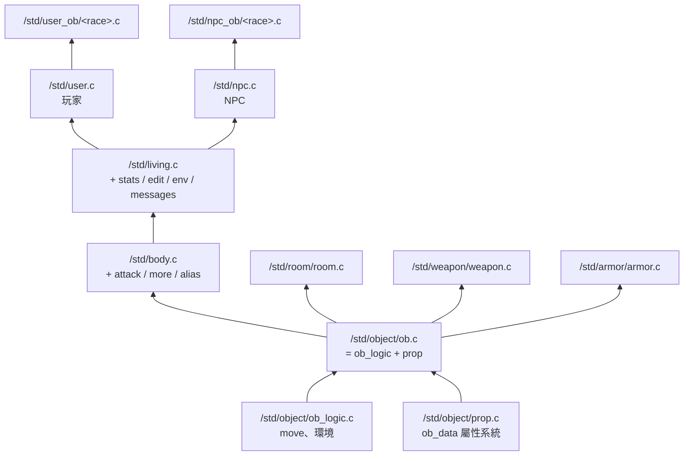

# 05 建構區塊

## 頂層目錄職責

| 目錄 | 職責 | uid |
|---|---|---|
| `/adm` | master、simul_efun 模組、daemons、`etc/` 設定 | `Root` |
| `/std` | 所有可繼承的基底類別 | `NONAME`（`/std/user` 例外為 `Backbone`） |
| `/cmds` | 指令，依權限分組 | `Root` |
| `/d/<領域>` | 遊戲區域，清單見 `include/domains.h` | 領域名（首字大寫） |
| `/obj` | 共用道具 | `Backbone` |
| `/open` | 開放給新手巫師的沙盒 | `Anonymous` |
| `/u/<首字母>/<名>` | 巫師個人目錄 | 該巫師名 |
| `/include` | 標頭檔，驅動自動 include `globals.h` | — |
| `/data`、`/log`、`/tmp` | 執行期產物 | — |
| `/doc` | 說明文件，含 `help/`、`wizhelp/`、`lpc/` 教學與本架構文件 | — |

uid 由 `master.c` 的 `creator_file()` 依路徑第一段決定，
見 [08 橫切概念](08-crosscutting-concepts.md)。

## 核心物件

### `/adm/obj/simul_efun.c`

**純聚合檔**，本身幾乎沒有程式碼，只有六十幾行 `#include "/adm/simul_efun/<x>.c"`。
被 include 的每個模組定義一到數個函式，它們對全遊戲而言就像 efun 一樣可以直接呼叫。

兩個必須知道的事：

1. **新增 simul_efun 一定要在這裡加一行**，否則寫了也沒用。
2. **順序有意義** —— 被依賴的要排在使用者前面。在同一個檔案裡，
   如果 `tell_room()` 排在 `message()` 之前，那 `tell_room` 裡呼叫的
   `message()` 會綁到 efun 而不是後面定義的同名函式。

### `/adm/obj/master.c`

驅動的 master object，是 mudlib 對驅動的**唯一控制面**。
驅動在特定時機呼叫它的 apply：

| apply | 時機 | 這個 lib 的實作 |
|---|---|---|
| `connect()` | 有人連進來 | clone 一個 `/std/connection` |
| `compile_object(file)` | 找不到 `.c` 檔 | 轉給 `VIRTUAL_D` 生虛擬物件 |
| `valid_read` / `valid_write` | 每次檔案存取 | 查 `/adm/etc/access`、`groups` |
| `creator_file(path)` | 物件載入 | 依路徑決定 uid |
| `error_handler(err, caught)` | 執行期錯誤 | 格式化後寫 debug.log、傳給玩家 |
| `log_error(file, msg)` | 編譯錯誤 | 依領域寫到 `/d/<領域>/log` |
| `epilog()` / `preload()` | 開機 | 讀 `/adm/etc/preload` |
| `crash(error)` | 訊號導致當機 | 喊話後關機 |

它 `inherit` 了 `/adm/obj/master/access.c` 與 `groups.c`，
權限清單可以不重開機更新。

## 繼承鏈

**一律用 `include/mudlib.h` 的巨集** 來指定 inherit 目標（`ROOM`、`NPC`、
`WEAPON`、`DAEMON`…），不要寫死路徑。同理 daemon 用 `include/daemons.h`、
目錄與指令路徑用 `include/config.h`。

## Daemon

`/adm/daemons/` 底下是常駐的單例物件，清單與路徑定義在 `include/daemons.h`。
重要的幾個：

| Daemon | 職責 |
|---|---|
| `CMD_D` | 掃描 `/cmds/*` 建立 `指令 → 檔案` 對照表 |
| `COMBAT_D` | 戰鬥訊息與武器動詞資料庫 |
| `VIRTUAL_D` | 把 `compile_object` 轉給各區域的 `virtual/server.c` |
| `WEATHER_D` | 天氣與時間 |
| `QUEST_D`、`EXPLORE_D` | 任務與探索進度 |
| `CHANNEL_D` | 頻道聊天 |
| `lest_d` | 測試與全站掃描（見 [10](10-quality-and-testing.md)） |
