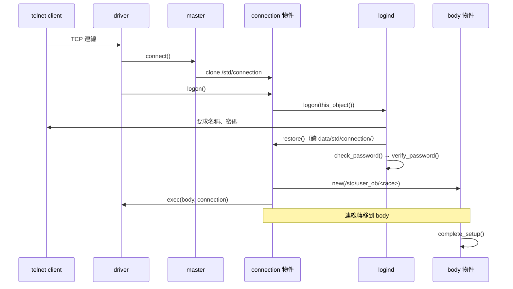
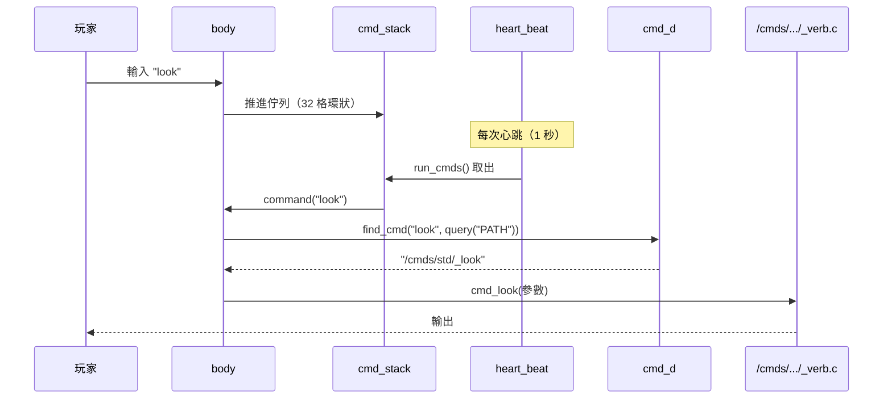
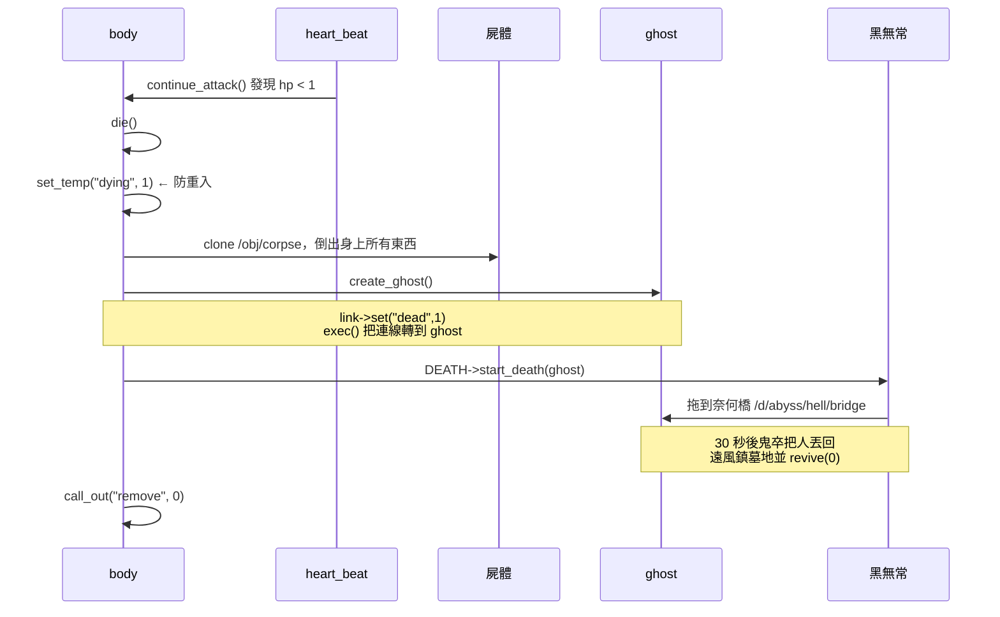

# 06 執行期視圖

## 開機

```
driver 啟動，讀 etc/fluffos.cfg
  1. 載入 simulated efun file  → /adm/obj/simul_efun
  2. 載入 master file          → /adm/obj/master
  3. 呼叫 master::epilog()     → 讀 /adm/etc/preload
  4. 逐一 preload 清單中的 daemon
  5. 開始接受 telnet 連線
```

順序不能改：simul_efun 必須先於 master，因為 master 用得到它定義的函式。

## 登入



**connection 與 body 是分離的兩個物件**，這是這個 lib 的一個核心設計：

- `/std/connection.c` —— 保存帳號、密碼、race、巫師旗標，存檔在 `data/std/connection/`
- `/std/user_ob/<race>.c` —— 實際在世界裡走動的身體，存檔在 `data/std/user_ob/<race>/`

分離的好處是死亡時可以把連線從屍體轉到鬼魂，而不必搬移一大堆狀態。
轉移靠驅動的 `exec()` efun，在 `connection.c::switch_body()`。

## 指令

**指令不是立即執行的。** 這是感覺上「反應慢」的根源。



**佇列空的時候會直接執行，不經過上面那條路。** `push_cmd()` 只在
「前面還有指令排隊」時才推進佇列 —— 所以單一指令是即時的，
連打時才會排隊並受「你同時下太多命令」的保護。見
[ADR-09](09-architecture-decisions.md)。

指令檔的慣例：`/cmds/<group>/_<name>.c`，`inherit DAEMON`（`/std/cmd_m.c`），
實作 `int cmd_<name>(string)` 與 `int help()`，回傳非 0 表示已處理。

玩家能用哪些 group 由 `query("PATH")` 決定，初始值來自 `include/config.h`
的 `NEW_NEWBIE_PATH` / `NEW_WIZ_PATH` / `NEW_ADM_PATH`。

**新增指令檔之後要 rehash `cmd_d`**，否則找不到。

## 心跳

`/std/user.c::heart_beat()` 是整個節奏的心臟：

```c
void heart_beat()
{
    if (hb_tick < MAX_TICK) {          // MAX_TICK = 8（include/body.h）
        hb_tick++;
        for( i = 0; i < 32 && cmd_top != cmd_bottom; i++ )
            run_cmds();                 // 清空指令佇列
        return;
    } else hb_tick = 0;
    continue_attack();                  // 每 8 次心跳才輪到戰鬥
    unblock_attack();
    heal_up();
}
```

心跳間隔由 `etc/fluffos.cfg` 的 `heartbeat interval msec` 決定（目前 1000ms）。
所以：

- **指令回應**：佇列空時直接執行（0.00 秒）；連打時同一次心跳清空整個佇列
- **戰鬥回合、治療、體力恢復**：8 次心跳 = 8 秒

歷史註記：原本 `run_cmds()` 每次心跳只吐一個指令，指令延遲直接等於心跳間隔
（實測 0.91 秒）。舊的 MudOS 0.9.20 心跳是編譯期固定 2 秒，更慢。

## 死亡



幾個關鍵：

- **防重入旗標必須立在 `die()` 的最前面。** `die()` 一旦中途拋出執行期錯誤，
  `heart_beat` 會每秒重新呼叫它 —— 屍體已經複製出來但 ghost 還沒接手，
  於是每秒多一具屍體。這個 bug 在本次升級實際發生過。
- `link_data("dead")` 不能單獨當防護：連線一中斷（`link` 為 0）它就一律回 0。
- 巫師在鬼魂狀態可以直接 `revive` 就地復活，且不吃技能懲罰
  （`/std/ghost.c` 的 `skip` 分支）；一般玩家走完流程會被扣 10% 技能。

## 虛擬物件生成

```mermaid
sequenceDiagram
    participant X as 某個物件
    participant D as driver
    participant M as master
    participant V as VIRTUAL_D
    participant S as &lt;目錄&gt;/virtual/server.c
    participant T as _foo.c

    X->>D: 引用 /d/eastland/easta/east_ent
    D->>D: 找不到 east_ent.c
    D->>M: compile_object("/d/eastland/easta/east_ent")
    M->>V: compile_object(同上)
    V->>S: 找最近的 virtual/server.c
    S->>S: new(ROOM) 產生空房間
    S->>T: _east_ent->create(那個房間)
    T-->>S: 設好 short/long/exits/objects
    S->>S: destruct(_east_ent)
    S-->>D: 回傳配置好的房間物件
```

找不到同目錄的 `virtual/server.c` 時會 fallback 到
`/adm/daemons/virtual/server`。全 lib 有 20 個以上的 server.c。

地圖式的虛擬房間（`*.east.c`）更進一步：
`/d/eastland/virtual/east_server.c` 讀 `eastland.map`（legend / room / map 三種區段）
依座標動態生成地形，`_x,y.east.c` 是覆寫單格的例外檔。
