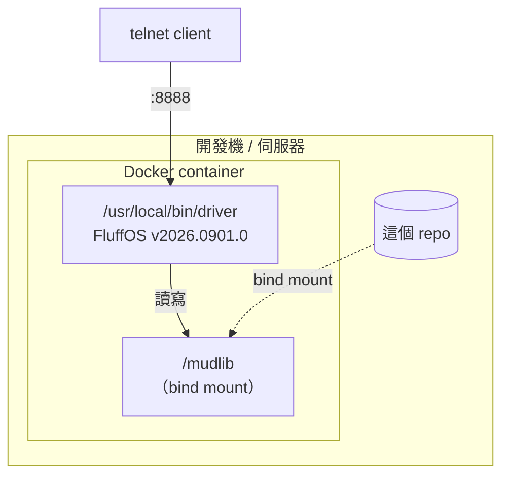

# 07 部署視圖

單一程序、單機。沒有叢集、沒有負載平衡、沒有外部相依服務。



## 容器

`.devcontainer/Dockerfile` 以 Ubuntu 24.04（FluffOS 官方主要支援平台）為基底，
從 GitHub clone 指定版本的 FluffOS 原始碼，用 cmake 建置後安裝到 `/opt/fluffos`，
`driver` 連結到 `/usr/local/bin`。

版本用 `ARG FLUFFOS_VERSION` 釘死，**不要用 master** —— 這個 mudlib 對驅動行為
極度敏感，版本浮動等於隨時可能壞掉。

locale 設成 `en_US.UTF-8`，因為 mudlib 已全面轉為 UTF-8，
驅動需要 UTF-8 locale 才能正確處理中文寬度。

```bash
# 建置（第一次約 3 分鐘）
docker build -t es-mud-fluffos:2026.0901 -f .devcontainer/Dockerfile .devcontainer

# 啟動
docker run -d --name es-mud -p 8888:8888 -v "$PWD":/mudlib -w /mudlib \
  es-mud-fluffos:2026.0901 driver /mudlib/etc/fluffos.cfg

# 連入（容器內已裝 telnet，省得在 host 上另外裝）
docker exec -it es-mud telnet 127.0.0.1 8888
```

用 `127.0.0.1` 而不是 `localhost`：driver 只綁 IPv4，用 `localhost` 會先試 `::1`
失敗一次才 fallback。

VS Code 直接開 `.devcontainer/devcontainer.json` 也可以，工作目錄掛在 `/mudlib`。

## 設定檔

**`etc/fluffos.cfg` 是現行設定**，不是根目錄的 `config.cfg`。
後者是 MudOS 0.9.20 / FluffOS 2017 時代的格式，保留只為對照。

FluffOS 2019 以後把許多原本是編譯期 `#define` 的行為改成執行期開關。
`etc/fluffos.cfg` 裡標示「相容」的項目是為了讓 1990 年代的 LPC 照原本語意運作：

| 設定 | 值 | 理由 |
|---|---|---|
| `sane explode string` | 0 | MudOS 0.9.20 兩者皆 undef，即舊 explode 行為 |
| `reversible explode string` | 0 | 同上 |
| `old type behavior` | 1 | 舊碼大量依賴寬鬆型別 |
| `old range behavior` | 1 | 負索引語意 |
| `this_player in call_out` | 1 | 舊碼在 call_out 回呼裡用 this_player() |
| `call_out(0) nest level` | 100 | 房間 create() 都會 call_out("reset",0)，連鎖載入容易疊過十層 |
| `mudlib error handler` | 1 | master.c 有 error_handler() |
| `heartbeat interval msec` | 1000 | 舊驅動編譯期固定 2 秒，這裡快一倍 |

**改動這些會改變既有 LPC 程式的行為**，不是單純的效能調校。

## 持久化與備份

所有狀態在檔案系統上：

| 路徑 | 內容 | 重要性 |
|---|---|---|
| `data/std/connection/` | 帳號（密碼雜湊、email、race） | 不可重建 |
| `data/std/user_ob/<race>/` | 角色（屬性、技能、身上的東西） | 不可重建 |
| `data/backup/` | 舊備份，多數是孤兒（對應的帳號已不存在） | 可丟 |
| `d/*/data/attic/` | 1990 年代的留言板歸檔 | 歷史文物 |
| `log/` | 驅動與 mudlib 的錯誤記錄 | 執行期產物（已 gitignore） |

**`log/debug.log` 在 driver 執行中不要 `rm`** —— driver 持有那個 handle，
刪掉之後它會繼續寫向已刪除的 inode，檔案不會重建，之後的錯誤全部看不到。
要清必須連帶重啟。mudlib 寫的那些（領域 log、`log/lest`）用 `write_file()`，
每次開關檔案，刪掉會自動重建。
